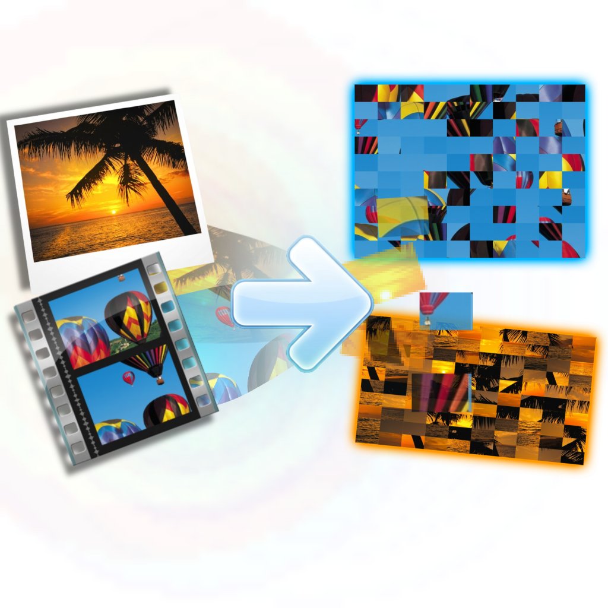

<div align="center">
  
</div>

# Media-Encrypt Studio

Welcome to **Media-Encrypt Studio**! This tool uses visual matrix scrambling and audio ring-modulation to completely encrypt your videos, images, and audio files locally. Features include custom grid size scrambling, center media overlay, advanced audio scramblers, and auto-generated SVG sequence numbered grids.

---

### 🛠️ Manual Installation Guide

If you prefer to run the application from the source code, please follow these steps:


**Clone or Download the Repository**: Download this project repository to your local machine and open your terminal (Command Prompt, PowerShell, or Bash) inside the project folder.

**Install Dependencies**: Run the following command to install the required libraries for mathematical, GUI, and media processing:
   ```bash
   pip install -r requirements.txt
   ```
   *(If that fails, you can install the individual libraries manually: `pip install Flask opencv-python numpy soundfile imageio-ffmpeg pillow pywebview`)*

**Run the Server**: Start the application by running:
   ```bash
   python main.py
   ```

5. **Access the App**: A native application window will open via `pywebview`. If the window does not appear, open your web browser and navigate to `http://127.0.0.1:5050` to use the studio.

---